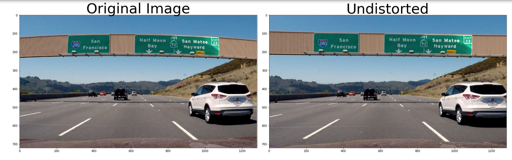
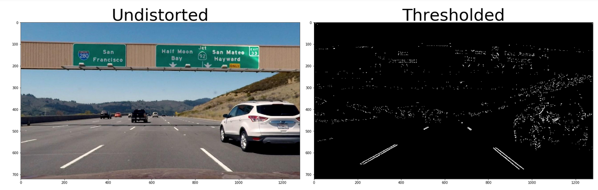
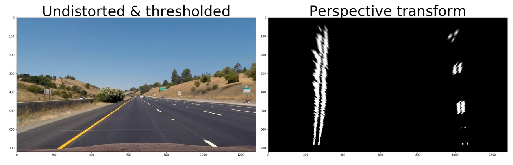
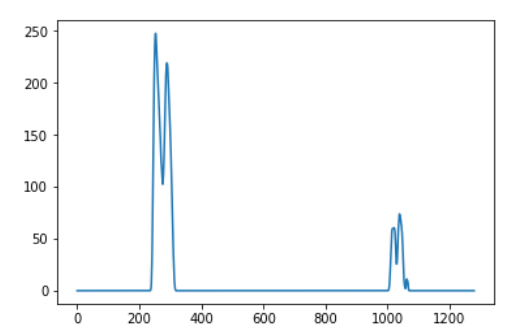
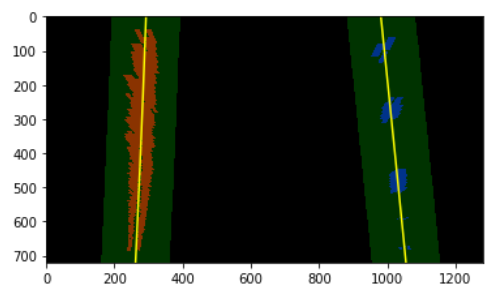
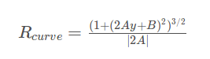
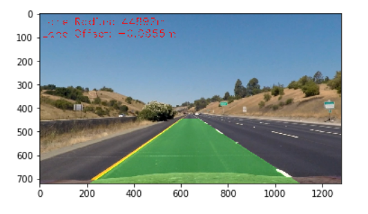

# Advanced Lane Finding Project

The goals / steps of this project are the following:

* Compute the camera calibration matrix and distortion coefficients given a set of chessboard images.
* Apply a distortion correction to raw images.
* Use color transforms, gradients, etc., to create a thresholded binary image.
* Apply a perspective transform to rectify binary image ("birds-eye view").
* Detect lane pixels and fit to find the lane boundary.
* Determine the curvature of the lane and vehicle position with respect to center.
* Warp the detected lane boundaries back onto the original image.
* Output visual display of the lane boundaries and numerical estimation of lane curvature and vehicle position.


---

### Camera Calibration


The code for this step is contained in the `./lane_lines_2/calibration.py`.

I start by preparing "object points", which will be the (x, y, z) coordinates of the chessboard corners in the world. Here I am assuming the chessboard is fixed on the (x, y) plane at z=0, such that the object points are the same for each calibration image.  Thus, `objp` is just a replicated array of coordinates, and `objpoints` will be appended with a copy of it every time I successfully detect all chessboard corners in a test image.  `imgpoints` will be appended with the (x, y) pixel position of each of the corners in the image plane with each successful chessboard detection.  

I then used the output `objpoints` and `imgpoints` to compute the camera calibration and distortion coefficients using the `cv2.calibrateCamera()` function.  I applied this distortion correction to the test image using the `cv2.undistort()` function and obtained this result: 

![alt text][image1]


### Pipeline (single images)

#### 1. Distortion correction.



#### 2. Color transforms, gradients or other methods to create a thresholded binary image. 
I used a combination of color and gradient thresholds to generate a binary image (`lane_lines_2.color_grad_thresh.apply_gradient_thresholds()`).  Here's an example of my output for this step.  




#### 3. Perspective Transform.

Code for perspective transform is in `lane_lines_2.perspective.apply_perspective_transform()`.

This function takes as inputs an image (`img`) and returns warped image and inverse transformation matrix. Instead of hard coding, the source and destination points are inferred from relative positions, which will make this insensitive to image size.

```
    height = img_shape[1]
    width = img_shape[0]
    offset = 0
    top_center_dist = .04
    bottom_center_dist = .35

    src = np.float32([[width * (0.5  -  top_center_dist )+ offset,height * 0.62],
                    [width * ( 0.5 - bottom_center_dist) +offset, height * 0.95],
                    [width * (0.5  + bottom_center_dist)+ offset, height * 0.95],
                    [width * (0.5  + top_center_dist) + offset, height * 0.62]])
    dst = np.float32([[width * ( 0.5 - bottom_center_dist) + offset, height * 0.0],
                    [width * ( 0.5 - bottom_center_dist) + offset, height * 0.95],
                    [width * (0.5  + bottom_center_dist) + offset, height * 0.95],
                    [width * (0.5  + bottom_center_dist) + offset, height * 0.0]])

```

I verified that my perspective transform was working as expected by drawing the `src` and `dst` points onto a test image and its warped counterpart to verify that the lines appear parallel in the warped image.




#### 4.Identify lane-line pixels and fit their positions with a polynomial

Code for this is in the ipython notebook `lane-lines-2.ipynb` `cell 8`.

I used histogram of perspective transform to identify location of lane lines at the bottom of the image:


and then used window search to find lane line pixels.




#### 5. Radius of curvature.

Code for this is in the ipython notebook `lane-lines-2.ipynb` `cell 13`.

The radius of curvature in world space is obtained by first transforming pixels positions to world space using scalar multipliers like:

```
ym_per_pix = 30/720 # meters per pixel in y dimension
xm_per_pix = 3.7/700 # meters per pixel in x dimension

```

then fitting polynomials to these transformed pixel position, and compute radius of curvature:




#### 6. Final result.

The code to implement entire pipeline is in ipython notebook `lane-lines-2.ipynb` `cell 13`.

Here is an example of final result on a test image:




---

### Pipeline (video)

#### 1. Provide a link to your final video output.  Your pipeline should perform reasonably well on the entire project video (wobbly lines are ok but no catastrophic failures that would cause the car to drive off the road!).

Here's a [link to my video result](./output/out_project_video.mp4)


Here's a [link to my challenge video result](./output/out_challenge_video.mp4)


Here's a [link to my extra hardchallenge video result](./output/out_harder_challenge_video.mp4)


---

### Discussion

#### 1. Problems, faults, room for improvement.

I began with modularizing and unit testing each functionality, and then put it together incrementally, first testing it on images. While woring with challenge video, my code started crashing, perhaps due to inability to handle missing/crooked/patchy lane lines. As an exception, I chose to return original image in these instances. This need further processing. My initial thoughts on this are basing output on previous image lane predictions.


```python

```
