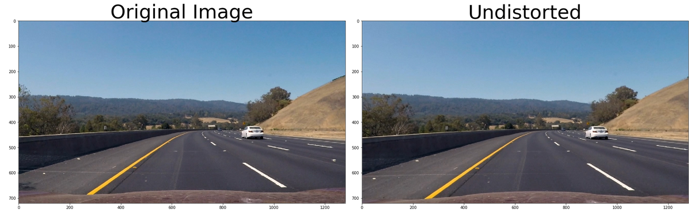
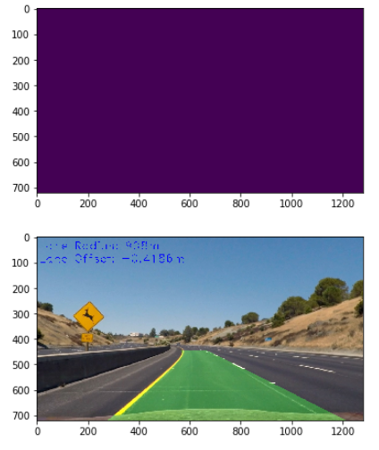

**Vehicle Detection Project**

The goals / steps of this project are the following:

* Perform a Histogram of Oriented Gradients (HOG) feature extraction on a labeled training set of images and train a classifier Linear SVM classifier
* Apply a color transform and append binned color features, as well as histograms of color, to HOG feature vector. 
* Normalize features and randomize a selection for training and testing.
* Implement a sliding-window technique and use trained classifier to search for vehicles in images.
* Run pipeline on a video stream (start with the test_video.mp4 and later implement on full project_video.mp4) and create a heat map of recurring detections frame by frame to reject outliers and follow detected vehicles.
* Estimate a bounding box for vehicles detected.

[//]: # (Image References)
[image1]: ./examples/car_not_car.png
[image2]: ./examples/HOG_example.jpg
[image3]: ./examples/sliding_windows.jpg
[image4]: ./examples/sliding_window.jpg
[image5]: ./examples/bboxes_and_heat.png
[image6]: ./examples/labels_map.png
[image7]: ./examples/output_bboxes.png
[video1]: ./project_video.mp4


---


### Histogram of Oriented Gradients (HOG)


#### 1. Features Extraction

The code for this step is contained in the IPython notebook  `vehicle_detection.ipynb`.  

I started by reading in all the `vehicle` and `non-vehicle` images.  Here is an example of one of each of the `vehicle` and `non-vehicle` classes:


I then explored different color spaces and different `skimage.hog()` parameters (`orientations`, `pixels_per_cell`, and `cells_per_block`).  I grabbed random images from each of the two classes and displayed them to get a feel for what the `skimage.hog()` output looks like.

Here is an example using the `YCrCb` color space and HOG parameters of `orientations=8`, `pixels_per_cell=(8, 8)` and `cells_per_block=(2, 2)`:


![alt text][image2]

#### 2. HOG parameters.

I tried various combinations of parameters and settled on following parameters which resulted in best vehicle detection accuracy, with low false positives.


```
color_space = 'LUV' # Can be RGB, HSV, LUV, HLS, YUV, YCrCb
orient = 8  # HOG orientations
pix_per_cell = 8 # HOG pixels per cell
cell_per_block = 2 # HOG cells per block
hog_channel = 0 # Can be 0, 1, 2, or "ALL"
spatial_size = (16, 16) # Spatial binning dimensions
hist_bins = 32    # Number of histogram bins
spatial_feat = True # Spatial features on or off
hist_feat = True # Histogram features on or off
hog_feat = True # HOG features on or off
```

#### 3. I trained a linear SVM using `sklearn`'s  `svm.LinearSVM` module with hinge loss. I chose svm due to its speed. The classifier achieved test accuracy of 0.9866, with  2432 feature vectors.

### Sliding Window Search

##### 1. Siding window search approach is implemented in function `find_cars` in `vechicle_detection.ipynb`. After exploring various search strategies, I finally settled on three window sizes. Smaller window sizes applied where vehicles would appear farther and smaller, and larger window sizes appled to search for nearer vehicles. 


##### 2. Examples

Ultimately I searched on two scales using LUV 3-channel HOG features plus spatially binned color and histograms of color in the feature vector, which provided a nice result.  Here are some example images:

*Note: The red color boxes are the final boxes and the yellow color boxes are all detected boxes.*


---

### Video Implementation

#### 1. Here are the vedeo detection results.

Here's a [link to project video](./output/project_video_out.mp4)


---

Here's a [link to test video](./output/test_video_out.mp4)


#### 2. Advanced detection

I recorded the positions of positive detections in each frame of the video.  From the positive detections I created a heatmap and then thresholded that map to identify vehicle positions.  I then used `scipy.ndimage.measurements.label()` to identify individual blobs in the heatmap.  I then assumed each blob corresponded to a vehicle.  I constructed bounding boxes to cover the area of each blob detected, and retained only those blobs with some threshold (e.g. at least 3 ioverlapping boxes) of overlapping boxes. 


#### 3. Lane lines

Lane lines using code developed for project 4 - advanced lane lines - following is the overview:

1. calibrate, undistort frame



2. apply color, gradient thresholds


3. perspective transform


4. detectect lane starting points from histogram


### Here are six frames and their corresponding heatmaps:


---



---


---


---


---


---

### Discussion

#### This conventional computer vision approach involves many trial and error manually tuned buttons which makes the process a lot tedious, at the end of which there are still many false positives. The newer deep learning approaches such as YOLO, SSD, etc seem a lot more promissing with realtime detection and tracking. 


```python

```
